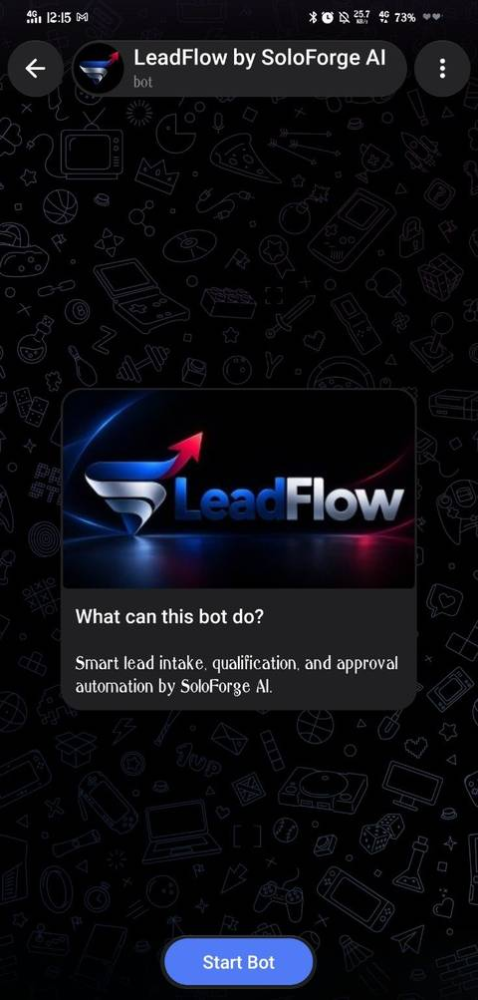
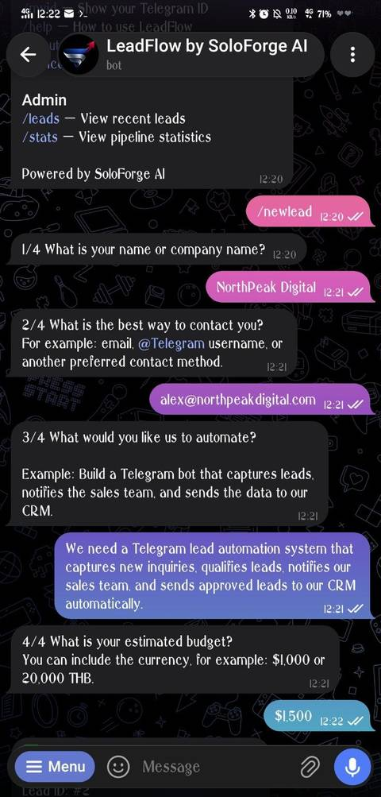
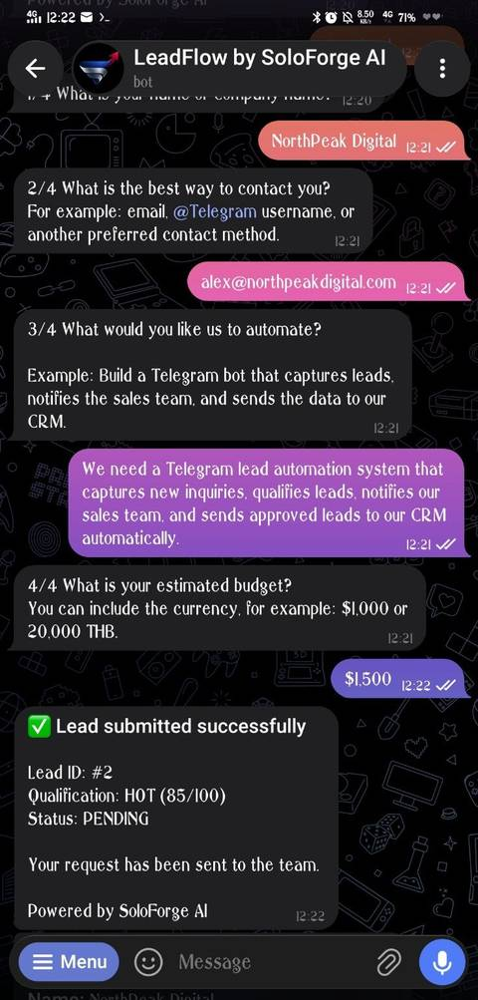
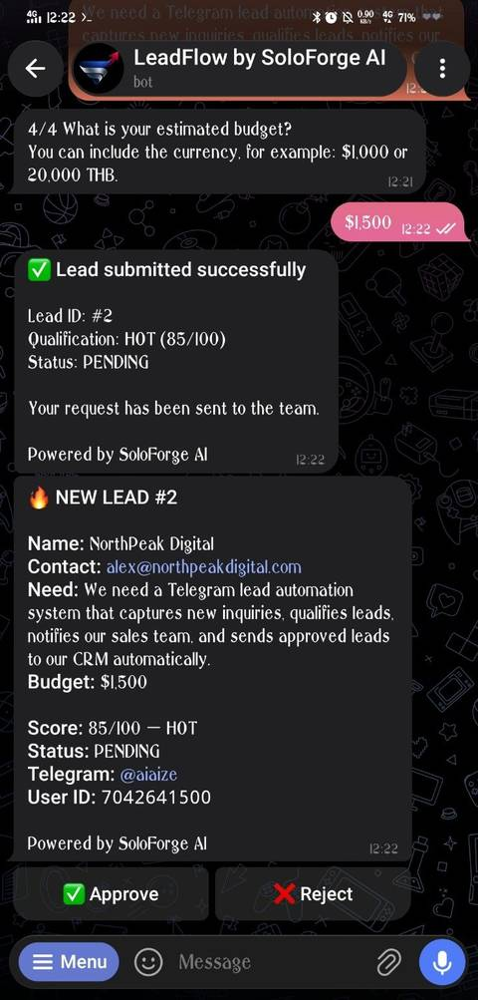
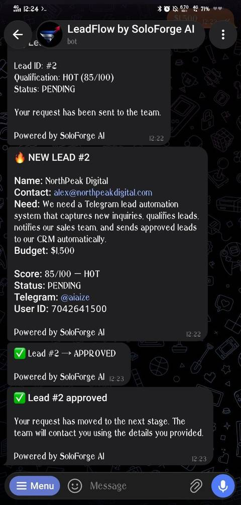

# LeadFlow by SoloForge AI

Smart lead intake, qualification, and approval automation for Telegram.

LeadFlow is a production-style portfolio project that demonstrates how a Telegram bot can turn incoming inquiries into a structured lead pipeline.

## What it does

- Guided lead intake with a 4-step conversation
- Automatic lead qualification: HOT / WARM / COLD
- Persistent lead storage with SQLite
- Instant admin notifications
- One-tap Approve / Reject actions
- Automatic status updates to the lead
- Recent lead view and pipeline statistics
- SoloForge AI branding throughout the experience

## Workflow

```text
Lead
  ↓
Capture
  ↓
Qualify
  ↓
Store
  ↓
Notify Admin
  ↓
Approve / Reject
  ↓
Update Lead
  ↓
Report
```

## Demo Workflow

The screenshots below show the complete LeadFlow journey from first contact to an approved lead.

### 1. Start — Product Overview

LeadFlow introduces the automation workflow, user commands, and admin functions directly inside Telegram.

<p align="center">
  
</p>

### 2. Intake — Guided Lead Submission

A new inquiry is captured through a simple four-step conversational flow: company name, contact method, automation requirement, and estimated budget.

<p align="center">
  
</p>

### 3. Qualification — Automatic Lead Scoring

After submission, LeadFlow stores the request and automatically assigns a qualification score and pipeline status.

<p align="center">
  
</p>

### 4. Admin Approval — Instant Review Workflow

The admin receives the complete lead context, qualification score, budget, and one-tap **Approve / Reject** controls.

<p align="center">
  
</p>

### 5. Approved — Automatic Status Update

Once approved, the lead status changes to **APPROVED** and the requester receives an automatic confirmation, completing the workflow.

<p align="center">
  
</p>

## Commands

| Command | Purpose |
| --- | --- |
| `/start` | Open LeadFlow |
| `/newlead` | Submit a new lead |
| `/myid` | Show Telegram user ID |
| `/help` | Show usage guide |
| `/about` | About LeadFlow |
| `/cancel` | Cancel the current form |
| `/leads` | View recent leads (admin) |
| `/stats` | View pipeline statistics (admin) |

## Tech stack

- Python
- Telegram Bot API
- python-telegram-bot
- SQLite
- python-dotenv

## Local setup

1. Create a Telegram bot with BotFather.
2. Copy `.env.example` to `.env`.
3. Add your bot token and admin Telegram ID.
4. Install dependencies:

```bash
pip install -r requirements.txt
```

5. Run:

```bash
python bot.py
```

Example `.env`:

```env
BOT_TOKEN=YOUR_TELEGRAM_BOT_TOKEN
ADMIN_CHAT_ID=YOUR_TELEGRAM_USER_ID
```

> Never commit a real bot token or production database.

## Portfolio use cases

The same workflow pattern can be adapted for:

- Sales lead routing
- Client intake
- Recruitment screening
- Order approvals
- Support escalation
- Content approval workflows
- Internal notification systems

## Current scope

This version is intentionally lightweight for portfolio demonstration. A production client version can be extended with PostgreSQL/Supabase, CRM integrations, webhooks, role-based access control, Docker deployment, AI qualification, and payment/subscription flows.

---

**LeadFlow — Powered by SoloForge AI**
